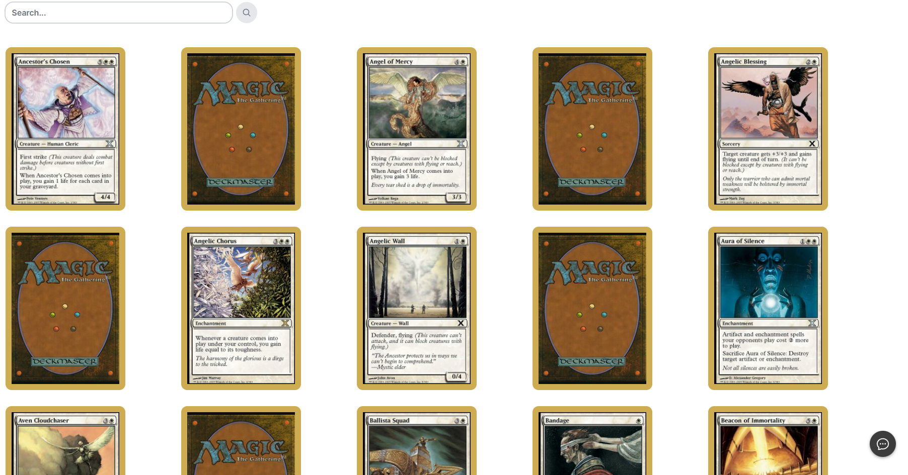
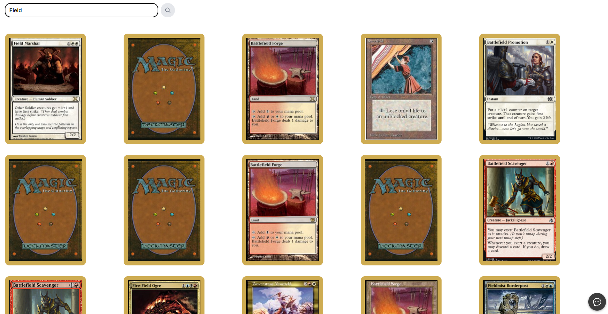
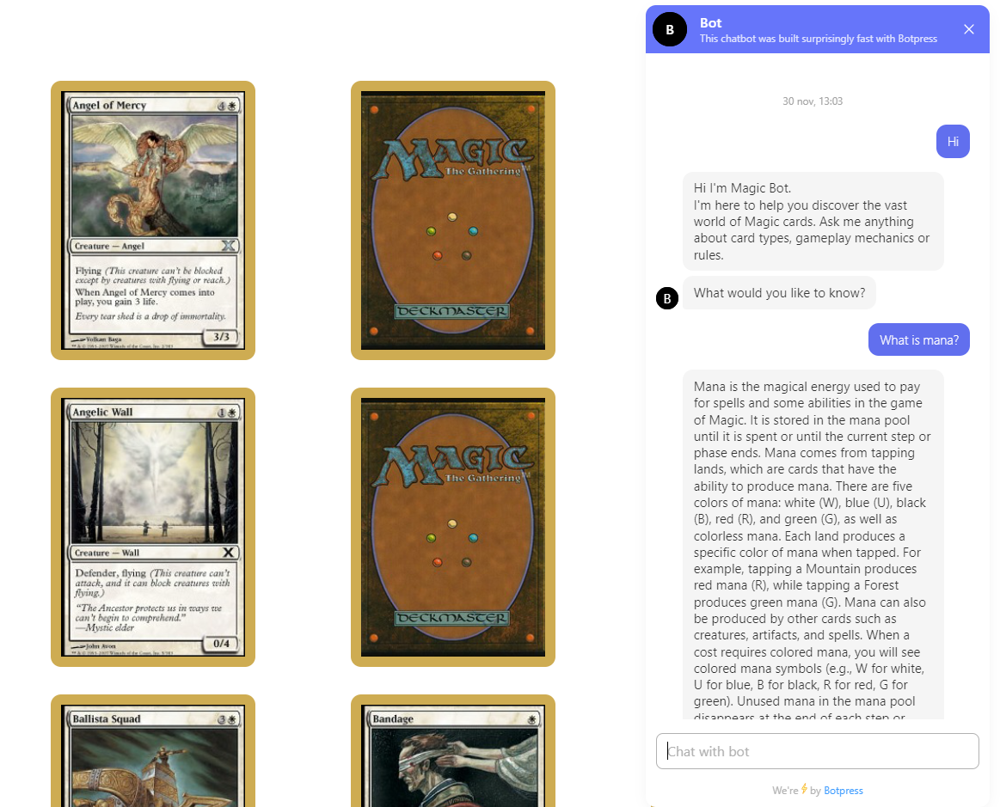

<h1 align="center">Magic: The Gathering Cards</h1>
<p align="center">
    
    
</p>

> This is a [Next.js](https://nextjs.org/) project bootstrapped with [`create-next-app`](https://github.com/vercel/next.js/tree/canary/packages/create-next-app).


This project utilizes Next.js, a React framework for building web applications.


## Prerequisites

- Node.js installed on your computer

## Installation Instructions

**1. Clone this repository or download :**
 ```bash
 git clone https://github.com/rozuke/mtg-cards-page
 ```
**2. Navigate to the project directory:**
```bash
cd mtg-cards-page
```
**3. Install dependencies:**
```bash
npm install
```

**4. Running the Project in Development Mode:**
To run the project on your local environment, use the following command:
```bash
npm run dev
```
This will start the Next.js development server. Navigate to `http://localhost:3000` in your browser to view the application.

## Screenshots
### Main view

### Search card

### Using bot
